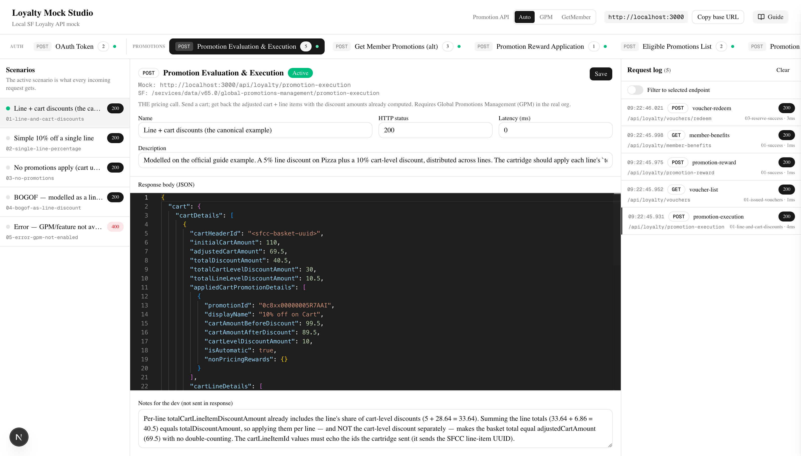

# Loyalty Mock Studio

A local Salesforce Loyalty API mock with a GUI on top, built for the SFCC cartridge developer who has to integrate against Loyalty before the SF org is even ready.

Run it on `localhost`, point your SFCC service definitions at it, and develop the whole flow — Promotion Evaluation → Promotion Execution → Voucher lifecycle → Member Info — without a real SF sandbox.



> **Companion cartridge (required):** the SFCC B2C Commerce adapter that consumes this mock is **[int_loyalty_adapter](https://github.com/vteckz/int_loyalty_adapter)**. It's the other half of the integration — the adapter's offline contract tests read this repo's `fixtures/` straight off disk (default path `../loyalty-mock-studio/fixtures`), so clone the two **side by side**:
>
> ```bash
> git clone https://github.com/vteckz/loyalty-mock-studio.git
> git clone https://github.com/vteckz/int_loyalty_adapter.git
> ```

## Why this exists

The proposed integration has SFCC consuming the Loyalty Promotion Evaluation / Execution APIs and injecting `PriceAdjustment` objects into the cart at calculate-time, plus a separate voucher fetch/reserve/redeem/release flow as a payment method. Both flows need realistic responses to develop against. This studio gives you those without needing the sandbox.

## Quick start

```bash
npm install
npm run dev
```

Open <http://localhost:3000>.

- **Top tabs** — every mocked endpoint
- **Left** — the scenarios available for that endpoint (each is one JSON file in `fixtures/`)
- **Middle** — Monaco editor: edit the response, change HTTP status, inject latency, save back to disk
- **Right** — live request log streamed over SSE; click a row to see headers, request body and response body
- **Guide** button (top-right) — an in-app developer guide covering wiring, scenarios, the promotion-mode switch, the `x-mock-scenario` test header and the tunnel caveat. It opens automatically on your first visit.

The green dot next to a scenario = the one your cartridge calls will currently receive.

## Mocked endpoints

The studio mocks the **full out-of-the-box Loyalty Management Business API surface** — **37 endpoints across 9 groups** — all reconciled against the official **Loyalty Management Developer Guide v67.0 (Summer '26)**. Promotion endpoints map to **Global Promotions Management (GPM)**; the rest to the standard Loyalty Connect REST API. Every fixture's path, method, and response field names were verified against the guide (each new one passed an adversarial second-pass verification).

### Core integration set (what the SFCC adapter actually calls)

| Method | Studio URL | Real SF path |
|---|---|---|
| POST | `/api/oauth/token` | `/services/oauth2/token` |
| POST | `/api/loyalty/promotion-execution` | `/global-promotions-management/promotion-execution` |
| POST | `/api/loyalty/get-member-promotions` | `…/program-processes/GetMemberPromotions` |
| POST | `/api/loyalty/promotion-reward` | `/global-promotions-management/promotion-reward` |
| GET | `/api/loyalty/vouchers` | `…/loyalty/programs/{program}/members/{membershipNumber}/vouchers` |
| POST | `/api/loyalty/vouchers/redeem` | `…/vouchers/{voucherCode}/redeem` (action: Reserve \| Reinstate \| Redeem) |
| GET | `/api/loyalty/members` | `/loyalty-programs/{program}/members` |
| POST | `/api/loyalty/transaction-history` | `…/connect/loyalty/programs/{program}/transaction-history` |

**Promotion Evaluation & Execution** is the core pricing call: send a cart, get back the adjusted cart + line items with discount amounts already computed (`adjustedCartAmount`, per-line `totalCartLineItemDiscountAmount`). **Promotion Reward Application** is the order-placement accrual step.

### Full API surface (grouped, as shown in the tab bar)

The remaining endpoints round out the OOTB Loyalty surface so the dev can mock any Loyalty call, not just the pricing/voucher flow. Mock paths are flat (`/api/loyalty/<id>`); the real documented SF path (with `{placeholders}`) is in each endpoint's `sfPath` and in the in-app **Guide**. Program processes (Issue/Cancel Voucher, Enroll/Unenroll, Credit/Debit Points, Update Member, Tier Processing) share the real `/connect/loyalty/programs/{program}/program-processes/{name}` resource and the standard process envelope (`{ status, message, simulationDetails, outputParameters: { outputParameters: { results: [] } } }`).

- **Promotions (9):** promotion-execution, get-member-promotions, promotion-reward, eligible-promotions, promotion-recommendations, coupon-usage-increase, coupon-usage-decrease, promotion-enrollments, enroll-in-promotion
- **Vouchers (4):** vouchers (list), vouchers/redeem (reserve/reinstate/redeem), issue-voucher, cancel-voucher
- **Members (5):** members (profile), member-benefits, engagement-trail, update-member-details, tier-processing
- **Enrollment (3):** individual-member-enrollment, corporate-member-enrollment, unenroll-member
- **Transactions (6):** transaction-history, transaction-ledger-summary, credit-points, debit-points, transaction-journals-execution, transaction-journals-simulation
- **Partners (2):** link-member-partner, unlink-member-partner
- **Clubs (3):** club-member-enrollment, club-member-profile, club-membership-renewal
- **Admin (4):** promotions-manage (create/list), promotion-detail (get/update), promotion-configuration, promotion-rule-configuration

> Some responses are partly **implementer-defined** in Salesforce (program-process `results[]` contents, promotion-rule event/reward maps). Those fixtures use the documented envelope with a plausible inner shape and say so in their `notes`. Add a new endpoint by following the 3-step pattern in `src/lib/endpoints.ts`.

**Get Member Promotions** is the *alternative* pricing path (still an open question for the Salesforce side). It's a program process returning the member's eligible promotions rather than a priced cart. Its response *envelope* is doc-confirmed (the standard Loyalty Program Process Output — boolean `status`, `outputParameters.outputParameters.results[]`, `simulationDetails`); only the *contents* of each `results[]` item are implementer-defined, so those inner fields in the fixtures are a plausible default. The adapter switches to it by setting `LoyaltyConfig.PROMOTION_API = 'GET_MEMBER_PROMOTIONS'`.

### Promotion API switch (header)

The header has a **Promotion API** toggle — `Auto | GPM | GetMember` — that mirrors the adapter's `LoyaltyConfig.PROMOTION_API`. It can't reach into the cartridge (that config lives in the SFCC code), but it makes the studio match the mode you're testing:

- **Auto** (default) — both promotion endpoints answer normally.
- **GPM** / **GetMember** — the chosen promotion endpoint answers normally; the *other* one returns a **409** with a message pointing at `LoyaltyConfig.PROMOTION_API`. So if the cartridge is pointed at the wrong resource for the mode you set, you find out loudly instead of via a silent wrong answer. The guarded tab is dimmed and badged `409`; the active one is badged `mode`.

> **Two things to know.** (1) **Voucher reserve/release IS supported** — the Redeem Voucher resource takes an `action` field (type `ReservationAction`, standard since API **v62.0**): `Reserve` (Issued→Reserved, returns a `reservationKey`), `Reinstate` (Reserved→Issued, the "release"), and `Redeem` (the default). It's the same `/redeem` resource for all three, not separate endpoints — see the `03-reserve-success` / `04-reinstate-success` fixtures. This matches the original proposal's "list → reserve → redeem/release" flow. (2) **BOGOF is modelled as a discount on a line already in the cart**, not as an injected product — see the `04-bogof-as-line-discount` fixture. Injecting a product the shopper didn't add isn't expressible in the GPM Cart response and is an open question for the Salesforce-side team.

## How a request gets answered

1. Cartridge calls e.g. `POST localhost:3000/api/loyalty/promotion-execution`
2. Handler looks up the active scenario for `promotion-execution`
3. Applies any `latencyMs` from the scenario
4. Returns the scenario's `response.status` + `response.body`
5. Logs the full request/response to the studio (visible in the right panel)

### Forcing a specific scenario per request

If you want to pick a scenario without using the GUI (for automated tests), pass a header:

```bash
curl -X POST http://localhost:3000/api/loyalty/promotion-execution \
  -H 'content-type: application/json' \
  -H 'x-mock-scenario: 04-bogof-as-line-discount' \
  -d '{}'
```

This is what the **contract test harness** should do — every fixture file becomes one test case that asserts the cartridge handles that response correctly.

## Adding / editing scenarios

Two ways:

1. **In the GUI** — pick the scenario, edit in Monaco, click **Save**. The studio writes back to `fixtures/<endpoint>/<id>.json`. Commit the diff.
2. **In your editor** — drop a new `.json` file into `fixtures/<endpoint>/`. Schema:

   ```jsonc
   {
     "name": "Human-readable name shown in the GUI",
     "description": "What this scenario is for",
     "request": { "body": { /* informational only — example of what produced this response */ } },
     "response": {
       "status": 200,
       "headers": { /* optional */ },
       "body": { /* whatever JSON SF would return */ }
     },
     "latencyMs": 800,        // optional — artificial delay
     "notes": "Edge cases the dev should test against"  // optional
   }
   ```

   Reload the GUI tab — the file appears.

## Suggested workflow for the SFCC dev

1. **Configure SFCC service** to point at `http://localhost:3000` (or the ngrok host). One service definition per endpoint.
2. **Wire the OAuth client** to `/api/oauth/token`. Pick the `01-success` scenario and confirm the cartridge caches and re-uses the token.
3. **Build the Promotion Applier** against `/api/loyalty/promotion-execution`. Cycle scenarios in the GUI and confirm:
   - `01-line-and-cart-discounts` → cartridge applies each line's `totalCartLineItemDiscountAmount` as an `AmountDiscount`; basket total lands on `adjustedCartAmount`
   - `02-single-line-percentage` → simplest happy path, one discounted line
   - `03-no-promotions` → cartridge clears any prior `LOYALTY_*` adjustments (cart returned unchanged)
   - `04-bogof-as-line-discount` → the free item is a discount on a line already in the cart (no product injection)
   - `05-error-gpm-not-enabled` → cartridge falls through to non-loyalty pricing, does NOT error the cart
4. **Order placement** → `/api/loyalty/promotion-reward` (accrue) + `/api/loyalty/vouchers/redeem`.
5. **Voucher flow** — list (`?voucherStatus=Issued`) → apply as a basket adjustment + **Reserve** (Issued→Reserved, keep the `reservationKey`) → on removal/abandon **Reinstate** (release) → **Redeem** with the `reservationKey` at order placement. The `03-mixed-statuses` fixture tests that you only offer `status=Issued` (Reserved is held, so it isn't offered either). Reservation is governed by the adapter's `LoyaltyConfig.VOUCHER_USE_RESERVATION` — turn it off to fall back to hold-the-code (e.g. for orgs below API v62.0).

## State persistence

- The **active scenario per endpoint** lives in memory. Restart the dev server = everything resets to "first fixture per endpoint".
- The **request log** is an in-memory ring buffer (200 entries).
- **Fixture files are on disk** — Save in the GUI = git diff = PR.

If you want the active selection to survive restarts, that's the natural next feature.

## File layout

```
loyalty-mock-studio/
├── docs/screenshot.png                # README image
├── fixtures/                          # All scenarios (commit these)
│   └── <endpoint-id>/*.json           # one folder per endpoint (37 endpoints)
│       e.g. promotion-execution/, vouchers/, member-benefits/, issue-voucher/, …
└── src/
    ├── app/
    │   ├── api/
    │   │   ├── oauth/token/              # OAuth mock
    │   │   ├── loyalty/<endpoint-id>/    # one route.ts per Loyalty endpoint (makeHandler)
    │   │   └── studio/                   # GUI control API (don't call from cartridge)
    │   └── page.tsx                      # The GUI
    ├── components/studio/                # GUI pieces (endpoint-tabs, scenario-editor, request-log, help-guide)
    └── lib/
        ├── endpoints.ts                  # Endpoint registry (add new ones here)
        ├── handler.ts                    # Shared scenario-lookup + response logic
        ├── fixtures.ts                   # JSON file I/O
        └── state.ts                      # In-memory active-scenario + request log
```

### Adding a new endpoint (3 steps)

1. Append an entry to `src/lib/endpoints.ts` (`{ id, name, method, mockPath: "/api/loyalty/<id>", sfPath, group, available, description }`).
2. Create `src/app/api/loyalty/<id>/route.ts` with one line: `export const POST = makeHandler("<id>")` (or `GET`).
3. Drop a fixture in `fixtures/<id>/01-success.json`. Reload — it appears as a new tab in its group.

## Caveats — fixtures reconciled to docs, not a live org

The fixtures were rewritten to match the shapes in the official **Loyalty Management Developer Guide** (Summer '26) — the promotion fixtures mirror the guide's own Cart example. They were **not derived from a real sandbox**, and two things still need confirmation from whoever builds the Loyalty side: (1) whether they use this GPM "Promotion Evaluation and Execution" resource vs. a Loyalty `GetMemberPromotions` program process, and (2) how/whether a "free product the shopper didn't add" is expressed. As soon as you have real sample responses, paste them into the GUI and **Save** — the studio doesn't care what's in the body.
